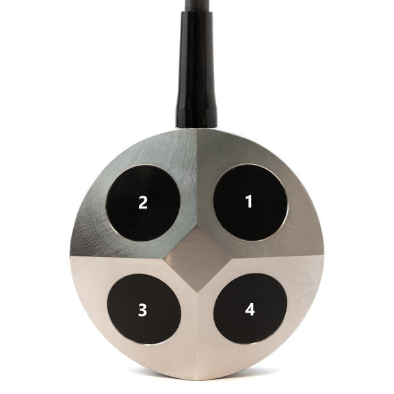

# DVL-A50 details

## Axis convensions

The axis on the DVL-A50 are oriented North-East-Down (NED)

* X axis is pointing forward (LED is forward, cable backward)
* Y axis is pointing right
* Z axis is pointing down (mounting holes are up, transducers are down)

## Transducer numbering

## Ethernet Interface

The DVL has a few services available on ethernet:

* Multicast DNS (mDNS) for easy discovery
* Web gui for easy setup and diagnostic
* TCP low latency velocity updates
* Updater for software upgrades

### Multicast DNS (mDNS)

Factory default for the DVL is to operate a DHCP client. This means it will attempt to obtain an IP address from a DHCP server on the same network.
For convenience the DVL supports mDNS to easily discover the assigned IP address.
The mDNS name used for the DVL is: `waterlinked-dvl`.

!!! note
    If no DHCP server is avaiable on the network, it is recommended to configure a static ip address as the DVL can use up to 5 minutes searching for a DHCP server.

### Web GUI

On operating systems supporting mDNS you can open the web GUI the following URL: [http://waterlinked-dvl](http://waterlinked-dvl).
If mDNS is not supported you need to obtain the IP address of the DVL and use that in your browser (http://IP_ADDRESS).

The web GUI shows the status of the DVL (velocity and altitude) as well as diagnostic information.
The web GUI also allows for network configuration.

### Network config

The DVL has two IP configuration options though the web GUI:

* DCHP client, where it obtains an IP address from a DHCP server on the same network.
* Static mode where the user sets the wanted IP address for the DVL.

Once the IP configuration is modified the DVL needs to be rebooted for the settings take effect.

### TCP Output

The DVL supports sending measurements updates using the Transmission Control Protocol (TCP). A TCP server is available on port **16171** which outputs the latest measurements to all the connected clients. In the web GUI you can see the number of connected clients and the format of the output message. See [description of the output protocol](./dvl-protocol.md).

### Software Upgrade

The DVL has the ability to be software upgraded. To upgrade the DVL go to [http://waterlinked-dvl:9000](http://waterlinked-dvl:9000) or http://IP_ADDRESS:9000 and follow the instructions there.

### Fallback IP

For convenience the DVL will always be available with the static IP address: **192.168.194.95**.
To be able to connect to the DVL using the fallback IP address perform following steps:

* Connect a ethernet cable directly from the DVL to your computer.
* Set static IP our computer to be **192.168.194.90**
* Open web browser open [http://192.168.194.95](http://192.168.194.95)
