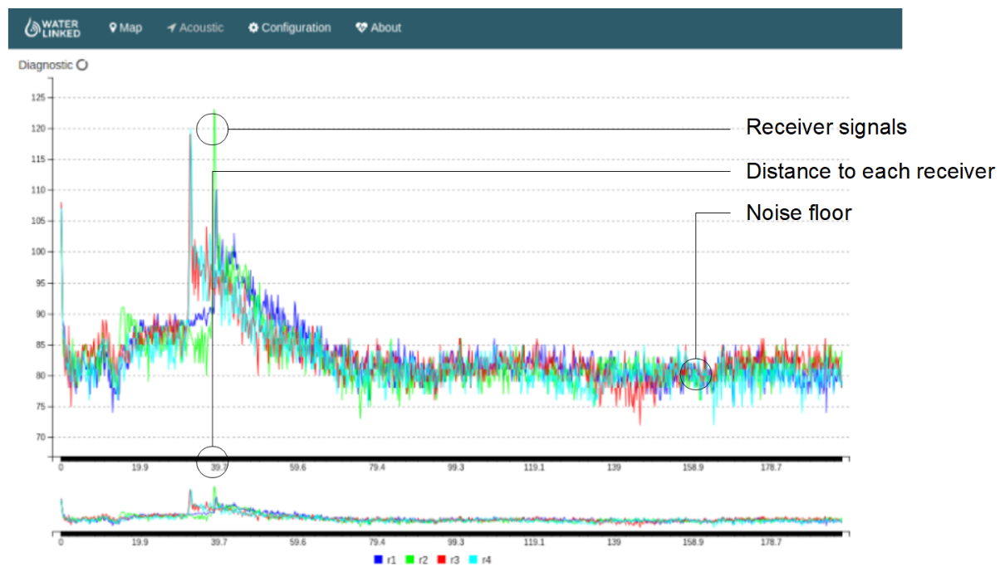
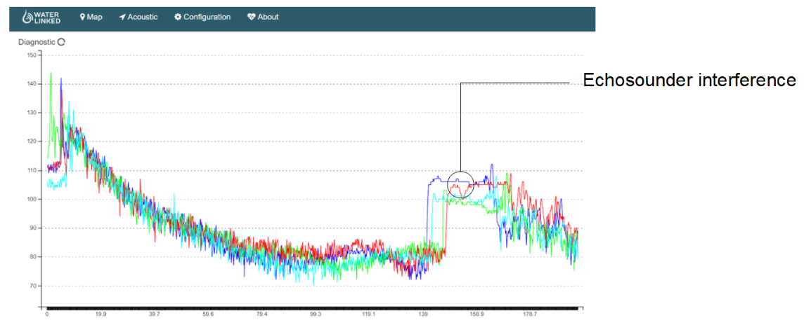

# Diagnostics

## D1 interface

Make sure the LED is ON for all D1 interfaces that are connected. The digital D1 interfaces all have a separate LED to show if the communication link is in lock. When a Receiver-D1 or Locator-D1 cable is connected to the master board, the corresponding LED should be continuously ON. The silkscreen marking of the channel LEDs on the PCB are 0-indexed. The channel labels on the housing are 1-index. We thus get following LED channel mapping:

| Interface           | LED |
| :------------------ | :-- |
| Receiver, channel 1 | 0   |
| Receiver, channel 2 | 1   |
| Receiver, channel 3 | 2   |
| Receiver, channel 4 | 3   |
| Locator-D1          | 6   |
|   |   |

The LED on the Locator-A1 interface is not in use.

## WEB diagnostics

Verify receiver signal strength in the diagnostic page on the web GUI.  Set your browser to 192.168.2.94/#/diagnostic. This view will show the signal strength from all receivers. It should look somethinglike

In the diagnostic plot we should see the signal from all 4 receivers. The signals should be above the noise floor.

## Interference

Acoustic interference can be observed in the diagnostic plot. Echo sounders from nearby boats typically appears like burst noise.

In case of interference from other acoustic sources, use the GUI to change the carrier frequency of the system.
