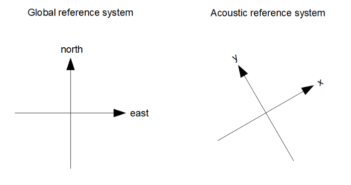

# Receivers

## Receiver guidelines

You can in principle place the receivers at any location within 100m from the origin of the acoustic reference system. In order to ensure the best performance, you should follow a few guidelines:

|                     |                      |
| ------------------- | :------------------- |
| **Line-of-sight**   | Try to place the receivers so they all have a free line-of-sight to the Locator. |
| **Good Separation** | The system performs better when there is a large distance between the   receivers. More separation is better, but 2x2 meters is sufficient for good  performance.   |
| **Max Range**       | There should be maximum 100m from any receiver to the Locator |
| **Receiver depth**  | Place the receivers at a few meters depth. Near the surface there are typically  small air bubbles caused by waves. These small air bubbles attenuate the  acoustic signal and can reduce the system performance.              |
| **Limit search area** | You will get a better position if you help the search algorithm to narrow the  search area. Limit the search range setting to the area where the Locator is  expected to be. |
| **Directivity**     | The Receivers have less sensitivity in backward direction (where cable enters).  Also, the Locator has less acoustic gain in the direction of the cable entry.  |
| **Receiver stability** | Add some weight to the receivers so they hang straight down in the water  |
| **On board GPS**    | If the master electronics is static during operation it is recommended to use the  static option for the GPS. This is to remove the inaccuracy of the GPS receiver  in global position. Only use onboard GPS when the reference system is moving  eg. if mounted to a boat.  |
|   |   |

## Reference Systems

In order to calculate the absolute position of the Locator we need to define two reference systems, the acoustic and the global reference system. The global reference system is defined by latitude and longitude and is the reference system used by the GPS and in maps.

The acoustic reference system  (the x and y axis) is defined by the orientation of the housing. The housing is by definition located in origin (x=0, y=0).  A label on top of the lid indicates the x-y coordinate system. The position of the receivers and the search area are specified in the Acoustic reference system.

## Boat Example

The illustration bellow shows a typical receiver configuration when installed on a boat. The receivers are hanging from the side of the boat, one in each corner. The depth of the receivers are typically 2-4m, deep enough to get below the hull and get free line-of-sight to the Locator. Notice how the housing defines the origin and coordinate system of the acoustic reference system.

