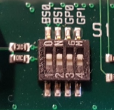
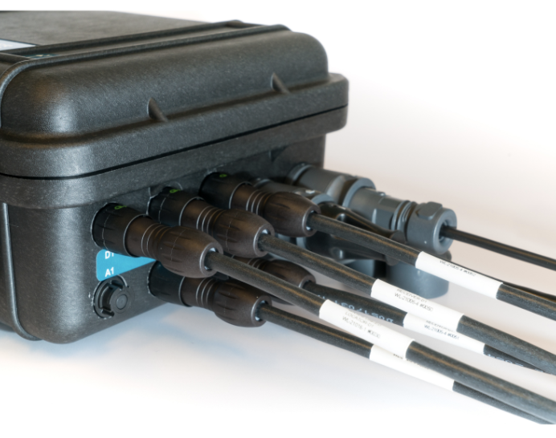
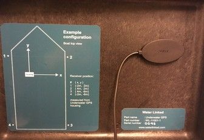
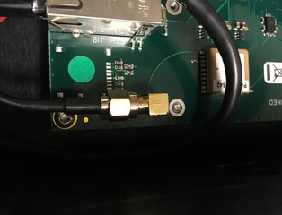

# Hardware Setup

## Network

At power-up, the Master-D1 reads the DIP-switch settings. The network mode depends on the GP0 and GP1 position.

| GP0                 | GP1                  | Network mode         | DHCP client example mode |
| ------------------- | :------------------- | :------------------- | :------------------- |
| ON                  | ON                   | DHCP client          |     |
| OFF                 | ON                   | Static IP 192.168.2.94 |                      |
| ON                  | OFF                  | Static IP 10.11.12.94 |                      |
| OFF                 | OFF                  | DHCP Server, 192.168.0.1 |                      |
|   |   |   |   |

The BS0 and BS1 positions on the dip switch shall both be ON. These boot-select pins are used in factory programming only.

Use the supplied Ethernet cable to connect the Underwater GPS to a network switch or directly into the host computer.

!!! note
    The host computer connected to the topside unit needs to have an IP-address on the same subnet as set on the Master-D1.
    For example: If the IP address of the UGPS is 10.11.12.94 the host computer needs to be configured to a different 10.11.12.x address e.g. 10.11.12.100.

## Connectors

* Connect the four Receiver-D1 cables to channel 1 to 4 on the housing.

* If using the Locator-D1, connect this to the D1 connector on the housing.

* If using the Locator-A1, connect this to the A1 connector on the housing.

* If using the Locator-S1, no connections to the housing is needed. Just power the Locator and make sure both the status led on S1 and master is solid green.

## GPS

The on-board GPS module is used to position the system in a global reference system. An external antenna with integrated amplifier is used to improve GPS reception. The signal strength of the GPS can be seen on the top bar in the web GUI.

### GPS-antenna assembly

The GPS-antenna can be mounted anywhere you want, but remember the GPS-antenna is the origin of the master electronics position. Therefor it is recommended to fasten the antenna on the lid of the peli case. With the 3M double sided tape, attach the GPS- antenna to the lid of the peli case.

Connect the GPS-antenna cable to the SMA connector on the master electronics. Torque the SMA nut to 3–5 in·lbf (0.3 to 0.6 N·m) or slightly more than finger tight.

## IMU

The master electronics has an built in IMU used to provide the orientation of the master electronics. This is used in combination with the acoustic position and GPS to generate the global position of the Locator.

### IMU Calibration

For the IMU to work properly it needs to be calibrated. The calibration data is stored when full calibration is obtained for faster calibration on restart of the system. If the system is started on a new location a new calibration is needed for the IMU to work as intended.

To calibrate the IMU disconnect all Recivers and Locator cables, but leave power and Ethernet connected. This is to prevent damaging the cables and connector when performing the calibration. While looking at the top bar in the web GUI on the IMU status, move the peli case in a figure of 8 until all the bars are green.
