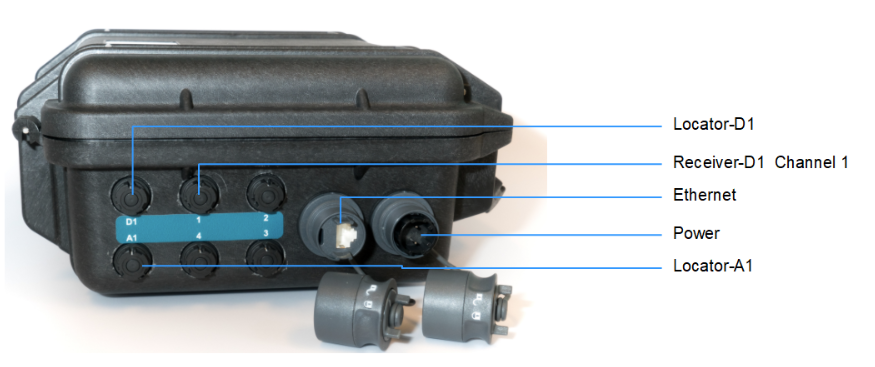

# Quickstart

## Intro

This is a quickstart guide on how to setup the Water Linked Underwater GPS. The steps you need to perform is:

* Power the topside unit
* Calibrate IMU
* Place receivers
* Connect everything
* Select locator and channel
* Configure receiver placement in GUI

## Power the topside unit

Start by connecting power to the topside unit. We do this because we want the GPS receiver to start get signals and get lock the position of the topside uint while we setup the rest of the system. If you are using the locator-S1 power it on such that it also have time to get GPS lock.

## Calibrate IMU

Next step is to connect the ethernet cabel to the topside unit and your computer. Then open your web browser and type in the IP-address of your topside unit which is defined by the position of the dip-switch. How to change the IP-address is described [here](https://waterlinked.github.io/docs/explorer-kit/hardware/). At the top bar on the GUI you will see a calibration bar for the IMU and a signal strength bar for the GPS. To calibrate the IMU rotat it in a figure of 8 and keep doing it until the IMU calibration bar becomes full and green.

## Deploying of receivers

Before starting to place the receivers in the water add piece of tap on the receiver cable on the desired depth to make setup easier. Place the receivers in the water on the desired location and decide what the numbering on each receiver is. This is important when connecting the recivers to the topside unit.

!!! tip
    Adding lead weights just above the receiver helps keep them stable when doing the positioning.

## Connect everything

When connecting the receiver cabels to the topside unit remember the numbering you decided on and connect the connector to the accordingly port. If this is not correct the position will be completely wrong. Next you connect the Locator if you are using the A1 or D1.

## Select locator and channel

Now that everything is connected and ready it is time to select the right locator and choose which channal to listen on. This is configurated on the setting page of the web GUI. The Water Linked standard is to use channel 17 and this is the default channel on the Locator-S1.

## Configure receiver placement and seach range in GUI

After selecting the correct locator you need to provide the correct placement of the receiver to the GUI for the positining algorithm to work correctly. This is done by draging and droping each receiver to the correct placment with regards to the topside unit. The position of each receiver is seen below the map view. It you click on the receiver you want to place a pop up with it exact placment. This can be used to place the receiver with better precision. Once this is done you can limit the search range by using tha same drag and drop feature.

!!! warning
    If you are using the Locator-A1 or S1, you need to provid depth information to the topside unit. Description on how to do this is found [here](https://waterlinked.github.io/docs/explorer-kit/gui/api/).

!!! tip
    Reducing the search range helps to improve the performance of the system. It is recomanded to limith this range if you are oppreting in a smaller area. This is especially important in tanks.

You are now ready to explor the underwater world and knowing where you are at the same time.